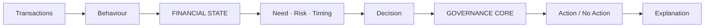
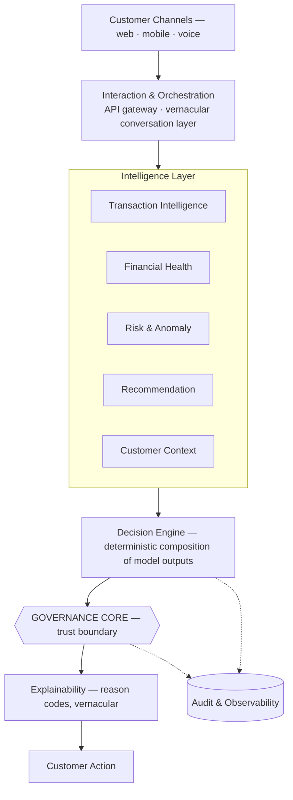
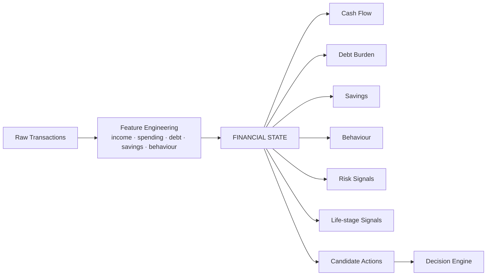
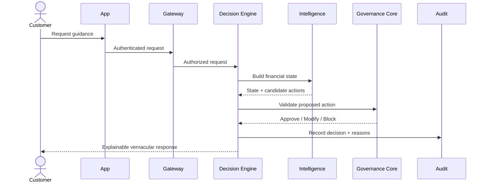
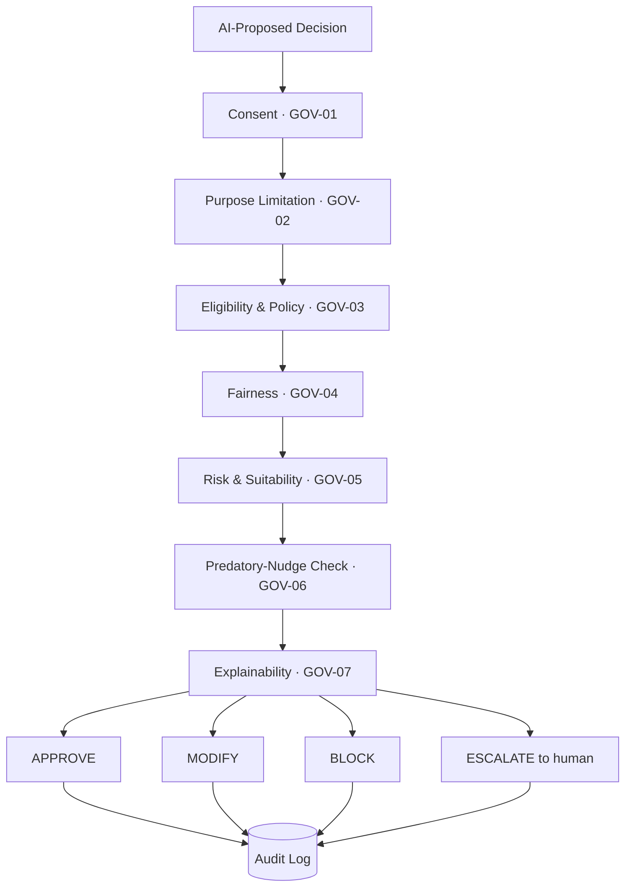

# ARTHDRISHTI

## Financial Intelligence for Bharat

> **"Your bank sees transactions. ArthDrishti sees financial life."**

**Team pizza · HackOut'26**

| | |
|---|---|
| **Hackathon problem statement** | AI-Powered Hyper-Personalized Banking for Bharat |
| **Theme** | Digital Transformation in Lending |
| **Our solution** | ArthDrishti — an AI-powered Financial Intelligence Layer for banking |

---

# 1 · The Idea

## The problem

India's digital banking rails — UPI, net banking, video KYC — are world-class. The experience built on them is not. Customers in Tier 2/3/4 towns and rural India find banking apps confusing, generic, and disconnected from their actual financial needs. Banks hold rich transactional and behavioral data, yet:

- Product offers arrive as generic pop-ups, not at the right moment for the right customer *(REQ-01)*
- First-time digital users get no vernacular, conversational path through onboarding, KYC, or loans *(REQ-02)*
- Financial stress and fraud signals surface late — and are handled punitively, not empathetically *(REQ-03)*

## A representative customer *(illustrative scenario, not a real person)*

**Ravi · 32 · salaried · digital banking user.** His bank sees salary credits, UPI transactions, EMIs, spending categories, savings. It does not see how his financial situation is *changing*.

Ravi asks: **"Mujhe ₹5 lakh ka personal loan lena chahiye?"**

- A conventional banking experience sees: **a loan opportunity.**
- ArthDrishti sees: **financial context** — cash flow ↓, EMI burden ↑, savings buffer ↓, repayment stress ↑.
- So ArthDrishti's Governance Core rules: **no loan recommendation → financial guidance instead.**

## The insight

> **Personalization should be state-aware, not profile-only.**
> A profile is static; a financial life is not. The same customer is a good loan candidate in March and a stressed one in August. ArthDrishti builds a continuously updated **financial state** for each customer and uses it to decide what action is appropriate *now*.

## The ArthDrishti Intelligence Loop *(D-01)*

**Observe → Understand → Predict → Govern → Help**

The two load-bearing nodes: **Financial State** (what the AI reasons over) and **Governance Core** (the gate every action must pass). AI can propose. Governance decides whether the system may act.

## The difference

| Conventional banking asks | ArthDrishti asks |
|---|---|
| "What can we sell?" | "What does this customer actually need?" |

*"Don't sell the next product. Understand the next need."*

---

# 2 · How ArthDrishti Thinks

## From transactions to financial intelligence *(ARCH-01, D-02)*

The architecture separates interaction, intelligence, decisioning, and governance — so intelligence services *propose*, the Decision Engine *composes*, and the Governance Core *disposes*.

The Governance Core is not a service among services — it is a **trust boundary**: nothing the AI proposes reaches a customer without passing through it.

## Technology — proposed choices *(the problem statement marks technology as advisory)*

| | | | |
|---|---|---|---|
| **Frontend** React / Next.js | **Backend** Python / FastAPI | **Intelligence** scikit-learn / XGBoost | **Language** Multilingual LLM / Indic NLP |
| **Data** PostgreSQL / pgvector | **Real-time** Redis / Kafka | **Deployment** Docker / cloud, India region | **Observability** Prometheus / Grafana |

Interpretable tabular models for financial prediction; an LLM only where language is the problem; one database with vector search rather than an extra datastore; India-region deployment to support data-localization design intent.

## Design principles

1. **Intelligence before interface** — the conversation renders decisions; it doesn't make them.
2. **Governance before action** — no customer-visible action bypasses the Governance Core.
3. **Explainability by design** — every decision carries reason codes at creation.
4. **Customer benefit over upsell** — suitability can veto revenue.
5. **Least-privilege, consent-scoped access** — services see only purpose-approved data.

---

# 3 · The Intelligence Engine

## A financial state — not just a profile *(AI-01, D-03)*

Raw transactions are never mapped directly to products. They are transformed into a structured, versioned **financial state** — the single object all downstream decisioning consumes.

Representative features *(proposed implementation logic)*: income stability and trend; category distribution and spending volatility; EMI-to-income ratio and repayment consistency; savings rate and liquidity coverage; transaction-frequency shifts and unusual merchant patterns.

## What the models do

- **Recommendation intelligence** *(AI-02)* — gradient-boosted ranking scores candidate products against the current financial state: relevance *and* suitability, not conversion alone.
- **Stress & anomaly detection** *(AI-03)* — unsupervised outlier detection (e.g., Isolation Forest) combined with interpretable rules (missed EMIs, cash-flow collapse). Outputs confidence scores, never verdicts.
- **Vernacular AI** *(AI-04)* — multilingual intent detection and grounded response generation, so a first-time digital user can bank in their own language.

## The LLM boundary *(AI-05)*

| ML · Rules · Decision Engine · Policy | LLM |
|---|---|
| **Analyses + decides.** Eligibility, scoring, risk, suitability — deterministic and auditable. | **Understands + communicates.** Intent, language, explanation of already-governed decisions. |

The LLM never approves products, determines eligibility, calculates risk, or overrides governance.

## Canonical request lifecycle *(D-04)*

Every journey — dashboard, chat, proactive nudge — is an instance of one flow:

---

# 4 · Trust Is Part of the Architecture

> **Trust is not a footnote. It is a control plane.**

The problem statement explicitly requires safeguards for data privacy and consent (DPDP Act, RBI data localization norms), algorithmic bias, and predatory nudging. ArthDrishti implements these as an architectural gate, not a checklist.

## Governance Core *(D-05)*

Every AI-proposed decision passes seven gates:

## ArthDrishti can say NO

> **"No product" is a valid decision.**
> Personalization is not about maximizing product conversion. It is about maximizing customer benefit.

Financial stress ↑ + debt burden ↑ + savings buffer ↓ → loan suitability ↓ → **Governance Core** → **no product** → financial guidance + repayment support.

*A financially stressed customer is not a sales opportunity. They are a customer who needs help.*

## Security & privacy *(SEC-01, D-06)*

Authentication → Authorization → Consent → Purpose Validation → Data Minimization → Encrypted Processing → Decision → Audit

Encryption in transit and at rest; tokenized customer identifiers inside AI services; consent recorded per purpose with revocation honored downstream; India-region data residency as a deployment constraint.

## Access control & lifecycles

**RBAC** roles (customer, relationship manager, risk officer, auditor, admin) set an access *ceiling*; **ABAC** attributes (consent scope, purpose, data sensitivity) decide each request. Role, request, and recommendation lifecycles are fully state-machined and audited (detailed in the technical appendix).

**Regulatory posture:** designed for regulatory readiness and alignment with DPDP and RBI expectations — design alignment, not legal compliance certification.

---

# 5 · See ArthDrishti in Action

## Hero demo *(illustrative prototype interaction on synthetic data — not real financial advice)*

**Customer:** "Mujhe ₹5 lakh ka personal loan lena chahiye?"

**ArthDrishti reads the financial state** *(illustrative values)*: EMI-to-income 41% · savings buffer 0.8 months · cash flow declining · 2 recent EMI delays · elevated stress signals.

**Governance Core:** loan offer **BLOCKED** *(GOV-06 — predatory-nudge check)*.

**ArthDrishti:** "Aapke haaliya cash-flow aur maujooda EMI bojh ko dekhte hue, naya loan financial stress badha sakta hai — isliye abhi loan recommend nahi kar rahe." *(English: given your recent cash flow and current EMI burden, another loan may increase financial stress — so we are not recommending one now.)*

**Why?** High EMI burden · low savings buffer · recent repayment stress.
**Instead:** repayment guidance + cash-flow improvement suggestions.

One interaction demonstrates personalization, AI reasoning, financial-state awareness, governance, explainability, and vernacular interaction — and shows the system declining revenue to protect the customer.

## What we build for the hackathon *(MVP)*

Synthetic transaction data · transaction categorization · financial-state engine · recommendation engine · stress/anomaly detection · vernacular conversational layer · Governance Core · explainable dashboard · end-to-end customer journey.

*Should have:* event-driven state updates, scenario simulation, multilingual voice, model monitoring. *Production path:* real core-banking / Account Aggregator integration, production identity, regulatory certification, large-scale model serving. The prototype is never claimed to be a production banking system.

## Measuring success *(evaluation targets — no measured results yet; synthetic data)*

| Capability | Target metric |
|---|---|
| Recommendation | Relevance / Precision@K |
| Stress detection | Precision / Recall / F1 |
| Anomaly detection | False-positive rate |
| Intent detection | Accuracy per language |
| Explainability | Explanation coverage |
| Governance | Unsafe-action block rate |
| System | p95 latency / error rate |
| Fairness | Group disparity metrics |

## Path to scale

Synthetic data → Account Aggregator / core banking → event-driven financial state → independently scalable AI services → monitoring + model governance. The prototype's service boundaries are the production boundaries — the same architecture, hardened, not rewritten.

---

# ARTHDRISHTI

**Financial Intelligence for Bharat**

> Understand before recommending.
> Govern before acting.
> Explain before influencing.
> Protect before selling.

**pizza · HackOut'26**

---

## Technical appendix / repository

Complete engineering artifacts are maintained separately in the project repository: full HLD & LLD · DFD Levels 0/1/2 · ER diagram & database schemas · API contracts & event schemas · sequence diagrams & state machines · request / customer / recommendation / role lifecycles · model architecture, feature definitions & evaluation methodology · governance policies · threat model & privacy model · data lineage · deployment architecture, CI/CD, observability, failure handling, scalability & model monitoring.
